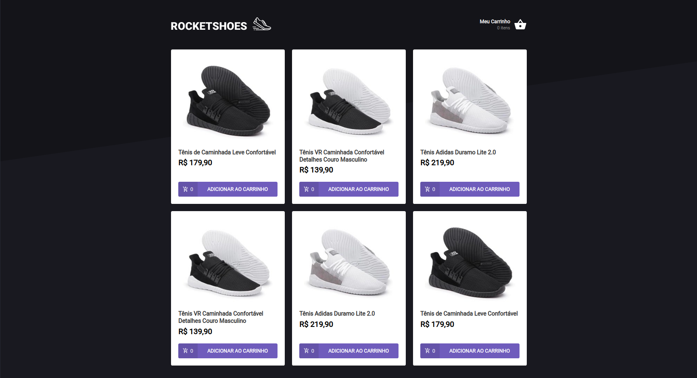

<h1 align="center">
  
</h1>

<h3 align="center">Rocketshoes e-commerce feito em React + Redux + Saga.</h3>


<p align="center">
  
</p>

## 🔧 Tecnologias
<p>Esse projeto foi desenvolvido com as seguintes tecnologias:</p>

- [ReactJS](https://reactjs.org/)
- [ReactHooks](https://pt-br.reactjs.org/docs/hooks-intro.html)
- [Redux](https://reactjs.org/)
- [Redux Saga](https://redux-saga.js.org/)
- [Axios](https://github.com/axios/axios)
- [react-toastfy](https://fkhadra.github.io/react-toastify/)
- [styled-components](https://styled-components.com/)
- [react-icons](https://react-icons.netlify.com/#/)
- [Reactotron](https://infinite.red/reactotron)


## 💾 Instalação

```bash
# Clone o repositório
https://github.com/rodrigosakamoto/Rocketshoes-web.git

# Em seguida execute:
$ cd Rocketshoes-web

$ yarn

#Para inicar o servidor
$ json-server server.json -p 3333

# Para iniciar a aplicação
$ yarn start
```
---
By [Rodrigo Sakamoto](https://www.linkedin.com/in/rodrigo-sakamoto/)
